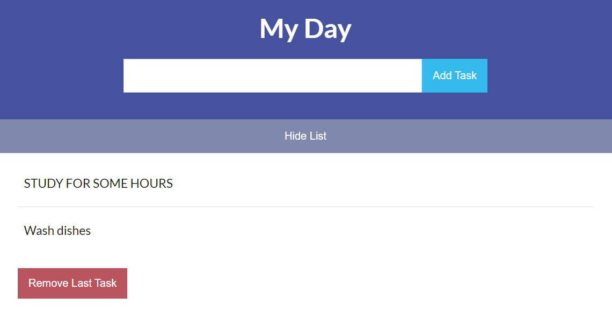

# To-Do List Web Application - README

Welcome to our To-Do List Web Application! This web app allows you to manage your tasks efficiently and stay organized. Below, you will find all the information needed to set up and use the application effectively.

## Table of Contents
1. [Introduction](#introduction)
2. [Features](#features)
3. [Technologies Used](#technologies-used)
4. [Installation](#installation)
5. [Usage](#usage)
6. [Contributing](#contributing)
7. [License](#license)

## Introduction

The To-Do List Web Application is a simple and user-friendly tool to keep track of your tasks and manage your daily activities effectively. You can add tasks, mark them as completed, and delete them when they are no longer needed. This project is perfect for learning the basics of web development and can be extended for more complex scenarios.

## Features

- Add new tasks with a title and optional description.
- Mark tasks as completed to keep track of your progress.
- Delete tasks that are no longer needed.
- Task data is stored locally in the browser, so you can close the application and return to your tasks later.
- Mobile-responsive design for use on various devices.

## Technologies Used

The following technologies were used to build this To-Do List Web Application:

- HTML5: For creating the structure and content of the web pages.
- CSS3: For styling and layout of the application.
- JavaScript: To add interactivity and functionality to the web app.
- localStorage: To store the task data locally in the browser.

## Installation

To set up the To-Do List Web Application locally, follow these steps:

1. Clone this repository to your local machine using `git clone `.
2. Navigate to the project directory: `cd to-do-list`.
3. Open the `index.html` file in your web browser.

That's it! The web application should now be up and running locally on your machine.

## Usage

Using the To-Do List Web Application is straightforward:

1. **Add Task**: Type the task title and, if needed, a description in the input field and press the "Add" button. The task will appear in the list below.
2. **Mark Completed**: When you complete a task, click the checkbox next to the task title. It will be visually marked as completed.
3. **Delete Task**: If you want to remove a task from the list, click the "Delete" button next to that task.

All your task data will be stored locally in the browser using `localStorage`. The tasks will persist even if you close the application or refresh the page.

## Contributing

We welcome contributions to improve and enhance the To-Do List Web Application. If you'd like to contribute, please follow these steps:

1. Fork the repository on GitHub.
2. Create a new branch with a descriptive name: `git checkout -b feature/my-awesome-feature`.
3. Make your changes and commit them with a clear message: `git commit -m "Add new feature"`.
4. Push your changes to your fork: `git push origin feature/my-awesome-feature`.
5. Submit a pull request, explaining your changes and why they should be merged.

